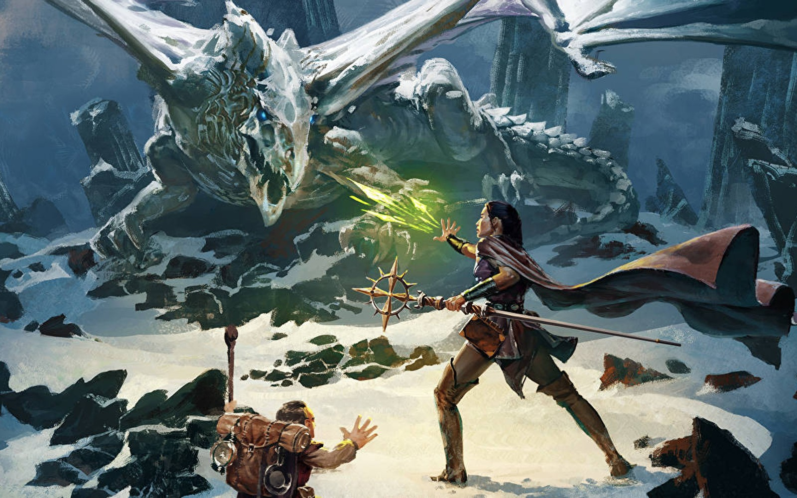

# Projeto Trybers and Dragons

Este foi o projeto de que exercitamos os conceitos de POO (Programação Orientada à Objetos) e SOLID.

Nele, fomos responsáveis por criar um jogo de RPG, inspirado nos antigos *Dungeons & Dragons*. Para isso, criamos algumas interfaces e criamos também classes que implementam essas interfaces.

Depois de criados todos os *chars*, criamos também classes que fazem eles batalharem entre si!

---

# Habilidades

- Exercitar os conceitos de SOLID;
- Desenvolver uma aplicação através do paradigma POO;
- Utilizar dos conceitos de Herança para criar classes genéricas;

---

## Requisitos

Ao todo foram 10 requisitos obrigatórios:

#### 1. Crie a classe `Race`;

#### 2. Crie classes que herdam de `Race`;

#### 3. Crie a interface `Energy`;

#### 4. Crie a classe `Archetype`;

#### 5. Crie classes que herdam de `Archetype`;

#### 6. Crie a interface `Fighter`;

#### 7. Crie a classe `Character`;

#### 8. Crie a interface `SimpleFighter`;

#### 9. Crie a classe `Monster`;

#### 10. Crie a classe `PVP`.
